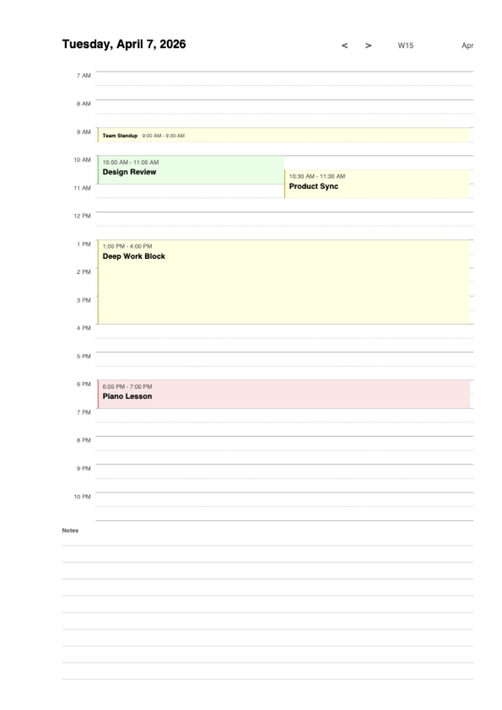
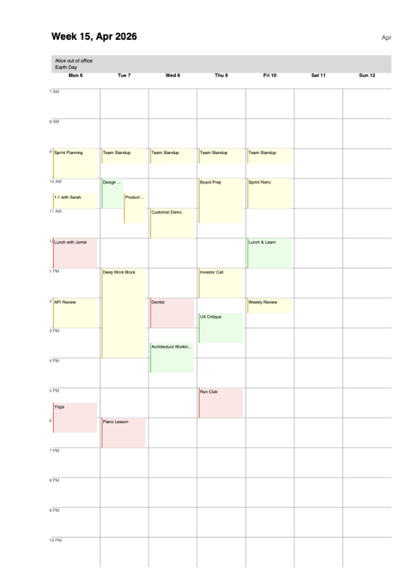
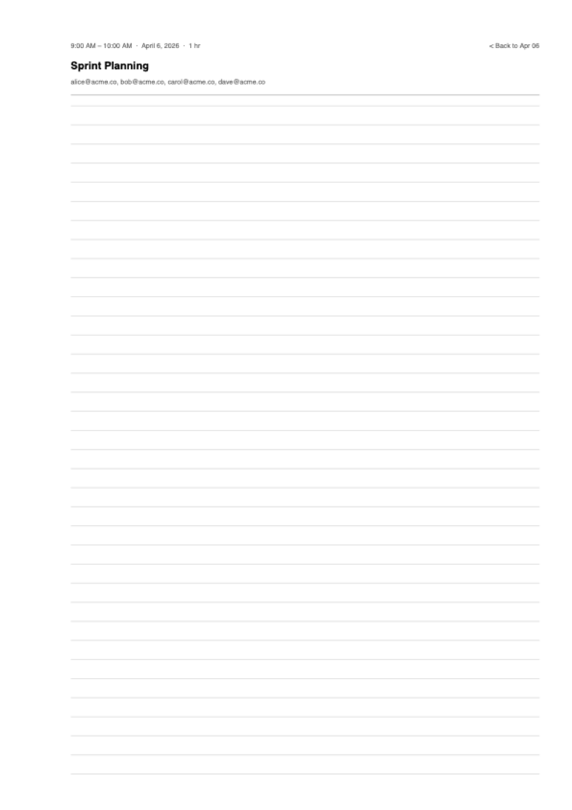

# rmCalendarMacOS

Turn your macOS Calendar into a handwriting-ready planner on your reMarkable tablet. Events sync automatically every 5 minutes, your handwritten notes are preserved across syncs, and everything is linked together so you can tap between views.

## Screenshots

| Day View | Week View | Meeting Notes |
|----------|-----------|---------------|
|  |  |  |

## What You Get

- **Year, month, week, and day views** linked together with tap navigation -- tap a date in the month view to jump to that day, tap a week number to see the week, tap a meeting to open its notes page
- **Color-coded calendars** -- each calendar gets its own color (pastel background + colored left stripe) so you can tell Work from Personal at a glance
- **Concurrent event tiling** -- overlapping meetings display side-by-side instead of stacking on top of each other
- **Meeting notes pages** -- each meeting gets a dedicated page showing time, attendees, and location, with lined space for handwritten notes
- **Annotation preservation** -- your handwritten notes survive every sync, even when meetings are added or removed. If a meeting you took notes on gets deleted, rmcal inserts a blank carrier page so your writing isn't lost
- **Auto-sync daemon** -- a background launchd service syncs every 5 minutes with no terminal window needed, surviving reboots and Homebrew upgrades
- **Guided setup** -- a terminal UI walks you through cloud registration, calendar selection, and meeting notes configuration on first launch

## Install

```bash
brew install thomasqbrady/remarkable/rmcal
```

Or from source:

```bash
git clone https://github.com/thomasqbrady/rmCalendarMacOS.git
cd rmCalendarMacOS
pip install -e .
```

## Getting Started

```bash
rmcal
```

On first launch you'll be guided through:

1. **Cloud registration** -- paste a one-time code from [my.remarkable.com](https://my.remarkable.com/device/remarkable?showOtp=true)
2. **Calendar selection** -- pick which macOS calendars to include
3. **Meeting notes** -- choose which calendars should generate per-meeting notes pages
4. **Upload** -- the planner is generated and synced to your reMarkable

macOS will prompt for calendar access automatically.

## Auto-Sync

Enable background sync so your planner stays current:

```bash
rmcal daemon install
```

This installs a macOS launchd daemon that runs `rmcal sync` every 5 minutes. No terminal window needed -- it runs silently in the background, even after reboot.

```bash
rmcal daemon status      # Check if the daemon is running
rmcal daemon uninstall   # Stop and remove the daemon
```

You can also manage the daemon from the TUI by pressing `d` on the calendar selection screen.

## Commands

| Command | Description |
|---------|-------------|
| `rmcal` | Launch the interactive TUI |
| `rmcal sync` | Headless sync (used by the daemon) |
| `rmcal generate` | Generate PDF without uploading |
| `rmcal register` | Register with reMarkable Cloud |
| `rmcal logs` | Show daemon log output |
| `rmcal logs --watch` | Follow daemon logs in real time |
| `rmcal daemon install` | Enable 5-minute auto-sync |
| `rmcal daemon uninstall` | Disable auto-sync |
| `rmcal daemon status` | Check daemon status |

## Options

```
--name TEXT        Document name on reMarkable (default: rmCalendar)
--start DATE       Start date YYYY-MM-DD (default: first of this month)
--end DATE         End date YYYY-MM-DD (default: 12 months from start)
--no-upload        Generate PDF only, skip cloud upload
-o, --output PATH  Output PDF path
```

## How It Works

1. rmcal reads your macOS calendars via EventKit
2. Generates a multi-page PDF with year/month/week/day views, cross-linked with tap navigation
3. Uploads the PDF to reMarkable Cloud, preserving any handwritten annotations from previous syncs
4. The daemon repeats this every 5 minutes, so new meetings appear and deleted ones are cleaned up

Annotations are preserved using a page-manifest system: each page is tracked by its bookmark identity (e.g. "day-2026-04-07", "meeting-2026-04-07-0"). When pages shift because meetings are added or removed, rmcal remaps your annotations to the correct page. If a meeting page is deleted but had annotations, a blank carrier page is inserted at the original position so your notes aren't lost.

## Requirements

- macOS (uses EventKit for native calendar access)
- Python 3.11+
- A reMarkable tablet with cloud sync enabled

## License

MIT
